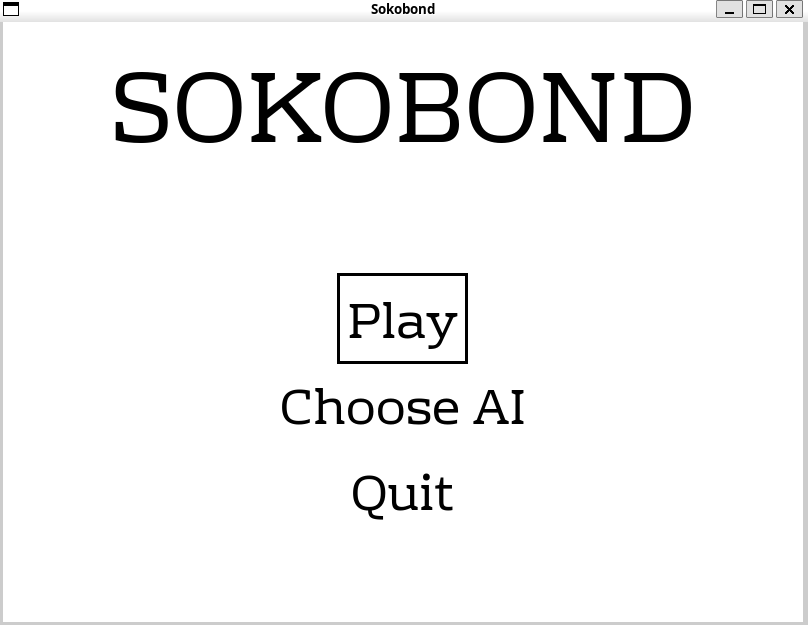
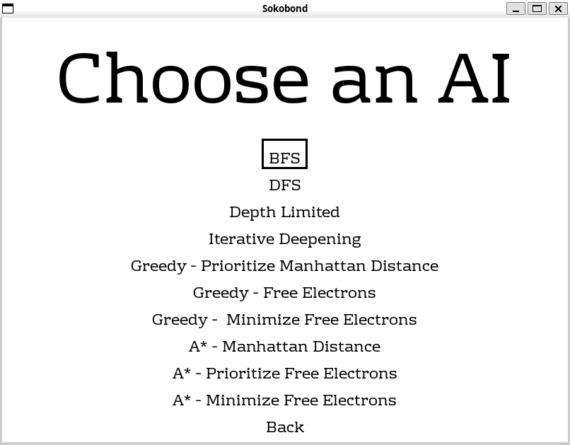
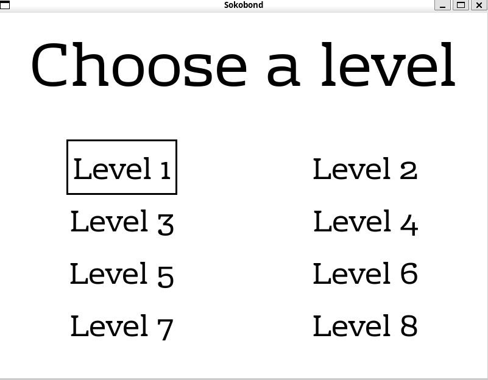
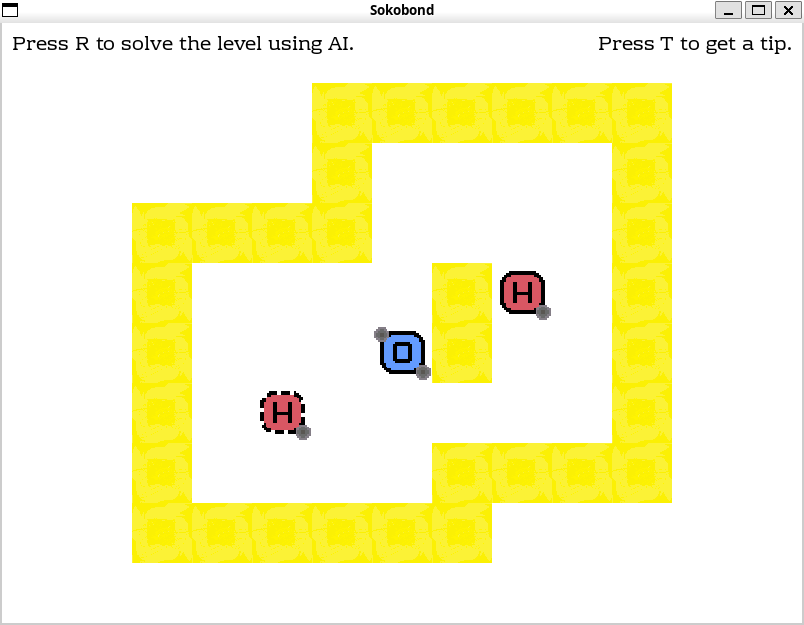

# Sokobond

<div style="text-align: justify">

## Table of Contents

- [Sokobond](#sokobond)
  - [Table of Contents](#table-of-contents)
  - [Introduction](#introduction)
  - [Rules](#rules)
  - [Setup](#setup)
  - [How to Play](#how-to-play)
    - [Controls](#controls)
    - [Menus](#menus)
  - [Relevant Links](#relevant-links)
  - [Problem Formulation](#problem-formulation)
    - [State Representation](#state-representation)
    - [Initial State](#initial-state)
    - [Objective Test](#objective-test)
    - [Operators](#operators)
      - [Move Operator](#move-operator)
  - [Algorithms and Heuristics](#algorithms-and-heuristics)
    - [Uninformed Algorithms](#uninformed-algorithms)
    - [Informed Algorithms](#informed-algorithms)
    - [Heuristics](#heuristics)

## Introduction

Sokobond is a game created by Alan Hazelden and Lee Shang Lun and "is an elegantly designed puzzle game about chemistry". The game is available on Steam and has been well received by players and critics alike. The game is a puzzle game where the player must move atoms to create molecules. The game is designed to teach players about chemistry and the mechanics of the game are based on real-world chemistry principles.

## Rules

In Sokobond, you control atoms on a grid with a clear objective: navigate them around and bond them with other atoms to create molecules. You have two main actions: moving in any of the four cardinal directions (`up`, `down`, `left`, `right`), or pushing nearby atoms in those same directions.

To form a molecule, simply move your atom/molecule to a spot adjacent to another atom with available bonding connections. Both atoms will then lose one bonding connection and combine. The game is completed when all atoms are merged into one molecule and all bonding connections are utilized.

If you are stuck in a level, you can ask the AI to solve it for you by pressing the `r` key. The AI will then calculate a sequence of moves to solve the level. If you want to solve the level yourself, you can press the `t` key to get a hint from the AI. The AI will suggest the next most strategic move to take.

## Setup

In order to run this game, Python and Pygame must be installed. Pygame can be installed using the following command:

```bash
pip install pygame
```

Once Pygame is installed, the game can be run using the following command:

```bash
python3 sokobond.py
```

## How to Play

### Controls

- **`Arrow` Keys:** Use the arrow keys to navigate through the game's menus and move your controlled atom/molecule within the game;
- **`r` Key:** Prompt the AI to assume control and solve the level;
- **`t` Key:** The AI will suggest the next most strategic move to take;
- **`esc` Key:** Press esc to quit the game.

### Menus

- **Main Menu:** Upon starting the game, the main menu will appear. Here, it can be chosen to navigate to the "Choose AI" or "Play" menus;



- **Choose AI Menu:** In this menu, the user can select the AI algorithm to be used to solve the level;



- **Levels Menu:** In this menu, the user can select the level to be played;



Once the level is selected, the game will start and the user can start playing:



## Relevant Links

- [Steam Page](https://store.steampowered.com/app/290260/Sokobond/)
- [Different implementation in JavaScript](https://github.com/vpelss/Sokobond_JS)
- AI UC books:

  - Stuart Russell, Peter Norvig; Artificial intelligence. ISBN: 978-0-13-207148-2
  - Richard S. Sutton; Reinforcement learning. ISBN: 978-0-262-03924-6
  - Stuart Russel, Peter Norvig; Artificial Intelligence: A modern Approach.

- [Pygame Documentation](https://www.pygame.org/docs/)

## Problem Formulation

### State Representation

Each state can be represented as the current configuration of atoms on the grid, including their positions and bonding connections.

### Initial State

The initial state is the configuration of the atoms on the grid at the start of the game, their bonding connections and which atom is the player controlling.

### Objective Test

Each solution can be considered as a sequence of actions that lead to the final state where all atoms are merged into one molecule and all bonding connections are utilized.

### Operators

#### Move Operator

- **Name**: Move
- **Preconditions**:
  - The controlled atom/molecule can only move to any of the four cardinal directions (up, down, left, right).
  - The controlled atom/molecule must be ajdacent to an empty cell in the direction of the move or an atom with no available bonding connections and an empty cell adjacent to it in the direction of the move.
- **Effect**:
  - The controlled atom/molecule moves to the new cell.
  - If the move results in the controlled atom/molecule being adjacent to another atom and the bonding limit of both atoms is not exceeded, a bond is formed.
  - If moved to a cell with another atom and there is no possible bonding connection, both the atom/molecule controlled and the atom in the cell will move to the next cell in the direction of the move - pushing the atom in the cell.
- **Cost**: The cost of this operator is 1.

## Algorithms and Heuristics

### Uninformed Algorithms

- **Breadth-First Search (BFS)**: This algorithm is used to find the shortest sequence of moves that leads to the formation of the final molecule. BFS explores all the possible (states) at the current depth before moving on to the next level. In this case the depth can be thought of as the number of moves needed to reach that state. So, BFS first considers all states that can be reached in one move, then all states that can be reached in two moves, and so on. The algorithm starts with the initial layout of atoms on the grid (the initial state). It then generates all possible layouts that can be reached by moving the controlled atom/molecule in any of the four cardinal directions (up, down, left, right). BFS continues this process, generating new states and adding them to a queue. It always removes and explores states from the front of the queue (i.e., the states that can be reached with the fewest moves). The algorithm stops when it finds a state where all atoms are merged into one molecule and all bonding connections are utilized. The sequence of moves that led to this state is the solution to the game.

- **Depth-First Search (DFS)**: This algorithm is used to explore the game's state space by going as deep as possible along each branch before backtracking. In the context of our game, a "branch" can be thought of as a sequence of moves. So, DFS first considers one possible sequence of moves to its fullest extent (until it either reaches a solution or can't go any further), then it backtracks and explores the next sequence. Just as the BFS, when the algorithm finds a state where all atoms are merged into one molecule and all bonding connections are utilized, the sequence of moves that led to this state is a solution to the game.

- **Iterative Deepening Search (IDS)**: This algorithm combines the advantages of Breadth-First Search (BFS) and Depth-First Search (DFS). It explores the game's state space by performing a DFS to a certain "depth limit", and it repeats this process with an increased depth limit until the goal state is found. So, IDS first considers all states that can be reached in one move, then all states that can be reached in two moves, and so on, just like BFS. However, instead of exploring all states at a certain depth before moving on to the next level, IDS performs a DFS to a certain depth limit. If the goal state is not found, the algorithm repeats the process with an increased depth limit. This way, IDS can find the optimal solution to the game.

### Informed Algorithms

- **A\* Algorithm**: A\* is an informed search algorithm that uses a heuristic function to estimate the cost of reaching the goal state from a given state. The algorithm starts with the initial layout of atoms on the grid (the initial state). It then generates all possible layouts and assigns a cost to each state based on the number of moves needed to reach that state and the heuristic function. The heuristic function estimates the cost of reaching the goal state from a given state. The algorithm continues this process, generating new states and adding them to a priority queue. When a state meets the goal test, that state is considered a solution to the game.

- **Greedy Search**: Greedy search is an informed search algorithm that always chooses the state that seems most promising at the moment. Just as the A\* algorithm after 
generating all possible layouts, it assigns a cost to each state based on the heuristic function. The algorithm then chooses the state based on the its cost and continues this process until it finds a state that meets the goal test.

### Heuristics

- **Manhattan Distance**: This heuristic function calculates the Manhattan distance between the controlled atom/molecule and the nearest atom that can be bonded. The Manhattan distance is the sum of the horizontal and vertical distances between two points. So basically, this heuristic will prioritize states where the controlled atom/molecule is closer to an atom that can be bonded.

- **Prioritize Free Electrons**: The idea behind this heuristic is that the player molecule is more likely to bond with other atoms/molecules if connected to atoms/molecules with more free electrons. This heuristic function calculates the number of free electrons of the controlled molecule and the nearest atom/molecule that can be bonded. The state with the highest number of free electrons is considered more promising.

- **Minimize Free Electrons**: This heuristic function calculates the number of free electrons of the controlled molecule and the nearest atom/molecule that can be bonded. The state with the lowest number of free electrons is considered more promising.
